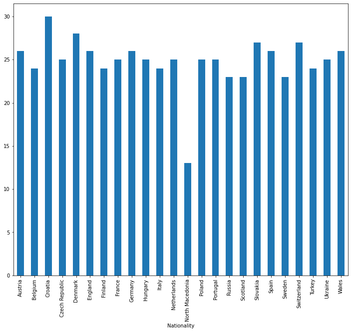
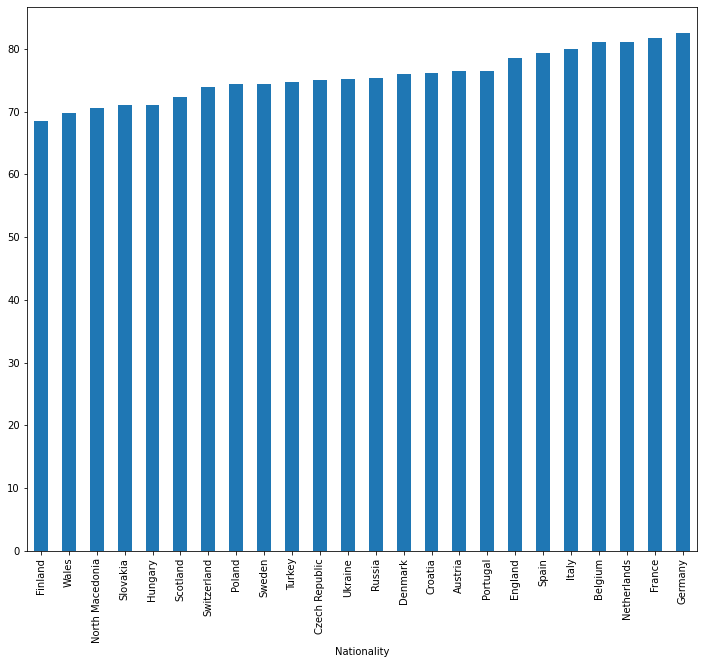
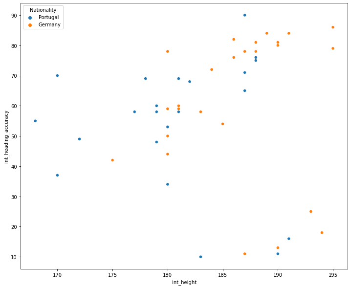

# Project of Data Visualization (COM-480)

| Student's name                    | SCIPER |
| --------------                    | ------ |
| Mahmoud Mohamed Nabegh Ahmed SAID | 309264 |
| Max STIEBER                       | 313425 |
| Simon Adam Johan HAMON            | 334060 |

[Milestone 1](#Milestone1) • [Milestone 2](#Milestone2) • [Milestone 3](#Milestone3)

## Milestone 1 (23rd April, 5pm)

**10% of the final grade**

This is a preliminary milestone to let you set up goals for your final project and assess the feasibility of your ideas.
Please, fill the following sections about your project.

*(max. 2000 characters per section)*

# Milestone 1

## Problematic

### Project Problematic

We aim to create a visualization to compare the teams participating in the upcoming EURO 2020 competition.

#### Motivation:
The EURO competition is considered by many the second biggest football competition (the most popular sport) in the world. Fans passionately follow the competition every 4 years, but the last year's competition has been delayed to June-July 2021, due to the pandemic. They normally tend to discuss matches with friends beforehand, and some place bets on certain teams(friendly or with booking agencies). For these reasons, we are trying to create an online tool that people can use to compare two teams head to head before their matches, to see how they stack up against each other.

#### Overview:
We are trying to include multiple features in the comparisons for people to be able to have fun and make informed decisions when they place their bets:
1. General comparisons between teams attack, midfield and defense according to stats.
1. Show stats that correlate with some simple strategies to expose teams' weaknesses and strengths.
1. Show odds according to betting agencies.
1. Show the current form of these teams

#### Target audience:
We are targeting football fans and especially people who like betting on football matches.

## Dataset

### Data origin
The dataset we rely on is the FIFA 2021 football game. The dataset provides a large amount of information on every professional player. Each player is rated on every aspect of its game. The dataset is under a CC0 Public Domain, which allows us to use it without copyright issues. 

Fifa dataset is widely used and accessible on Kaggle, thus the data is of great quality. It normally does not require much preprocessing nor cleaning. 

### Additional information

However to answer our problem we have to enter European teams that are not directly available in the dataset. We have to cross the main dataset with a famous website composition for national teams.

To collect nationals teams we have to use scrapping. Then we create national teams, and then can use the data to compare or inform on Euro participants statistics. 

## Exploratory Data Analysis

As said in the previous section, the dataset has a good quality. After creating the Euro teams we can explore the data. 

### Teams composition

The first interestings statistics is to see how many players are competing to be selected for the Euro. Indeed we are in April, the final composition for national teams haven't been released. Therefore teams can have more than the 23 official players. 

Here is a chart that shows us how many players are in each team:

As you may have noticed, North Macedonia has only 13 players for the moment, this translates into the fact that final teams are not known, and especially the website we extract teams compositions haven't investigated on North Macedonia possible players. 

Then thanks to Fifa players ratings we can calculate the average rating for each teams. Here is the chart of teams average ratings: 

This statistics is trustable thanks to the work put from EA games to have the most precise grade for each player in each aspect of his game. The ratings of players are conducted by  hundreds of scouts. Their ratings translate into a rating for many categories between 0 and 99. Fifa ratings also take in account the level where a player evolves, as the competition increases.

Comparisons that we want to show have an objective to compare team abilities in certain aspects. For example here is a comparison between Portugal and Germany, in terms of heading abilities of players: 

We decide to represent heading rates in function of player height as it is an important consideration.
Those charts purpose is to represent how we can handle data to compare teams, and thanks to Fifa dataset we can do comparison in every aspect of game, such as finshing of strikers, defense strength.
We still have to consider that there is some parameters that we cannot control or implement, such as team configuration on field, coachs orders or players confidence.

## Related work

### Other Work
As we could have expected, the Fifa dataset has been explored by many other people. Every year, a new Fifa game with updated ratings is put on the market. Over the years several data visualizations have been done. Those work are easy to find as people put them online, the goal is to give access to charts and plot to show interesting data for football fans, such as average year per championship, most represented country in the game and other statistics. 

Those visualizations give a good overview of the dataset, that can help us to see opportunities that we can do with this dataset. 

The main difference is that we want to do more specific visuals, more precisely on national teams for international events. 

We were not able to find such a work, especially with the same Dataset. Indeed some studies are related with World's Cup statistics but they don't rely on Fifa game dataset. 

### Our approach
Our  approach relies on international events and the main goal is to give a good overview of national players that will play against each other, and also statistics about both teams, their weaknesses or forces in matter of statistics.

The originality is in the fact that it will bring an overview of the different teams and players and compare them. These visualization can interest hardcore fans and the more casual ones as the European Cup is a mass event.

### Visualization inspiration
The idea comes from having a dataset with data that can reach almost every human on Earth, and in meanwhile serving global interest to inform fans on their teams and opponents. 

A common football team representation is a picture of every player on their respective position on a football pitch. For the plot appearance, something understandable and nice to watch is better. But as it will be online we will use interactions to give life to the data. 

None of us already used this dataset.

## Milestone 2 (7th May, 5pm)

**10% of the final grade**

As a reminder, we want to provide a easy comparison tool for football teams competiting for the Euro 2021. 

The goal is to have a comprehensive and intuitive tool, that easily present rudimentary analysis, for a wider public, and also more specific comparisons for fan. 

### Sketches 

#### Basic comparison

The competition teams are divided in groups for the pool phase. As we want to compare 2 teams we want to provide an easy selection, such as a drag and drop of national teams, based on their flags : 

When 2 teams are selected basic statistic are provided. We select radar graphs, with a background part in gray of the average statistics, thanks to their intuitive representation.

The previous part allow anyone to understand how it works. We will add guideline to make it even clearer.

Then users are invited to scroll down to access advanced statistics, centered on players. Yet we don't know if we want to forbid scrolling before selecting teams, because statistics will be empty, so there is no point in terms of comparison, but meanwhile it could help user to understand the processus of selection. 

#### Advanced statistics

Advanced statistics are about teams's player. Our goal is to make a dynamic graph, with filtering selection made by user, that represent player on differents statistics.  We are highly inspirated by a graph avalaible in first diapositives : 

As represented with a light gray background, user can select there filters. Plus on hover the user will have more information on players. 
We will also provide a sliding effect, on sides, to access each team more precise data, such as number player and their score in main aspect of game.

The last will be about strength and weaknesses comparison. We aim to detect some statistical aspect of the game that can be judged as a weaknesses or strengths. Our 
We are mainly restrict to use team compositions because systems vary a lot and are not known in advance, as well as for titularized players. To counter that we can still show better player in each position. 

### Extra upgrades 

One of our thoughts as an upgrade will be to implement team composition, formation as well as those 11 players, in the matter of statistics. Therefore users could change as they wish the composition, at least for starting players.

### Tools 

As expected, to implement our project, we will use all lectures about HTML, CSS and Javascript. Our graphs require the use of 3D.js library. Plus for interaction and design, we will rely on lectures on interactions and perception colors. Two futurs lectures, graph and tabular data, will be useful as well for our comparison representation. It might gives us advice and tricks to adapt our graphs.

### Website 

A draft website is avalaible here 
## Milestone 3 (4th June, 5pm)

**80% of the final grade**

## Late policy

- < 24h: 80% of the grade for the milestone
- < 48h: 70% of the grade for the milestone

